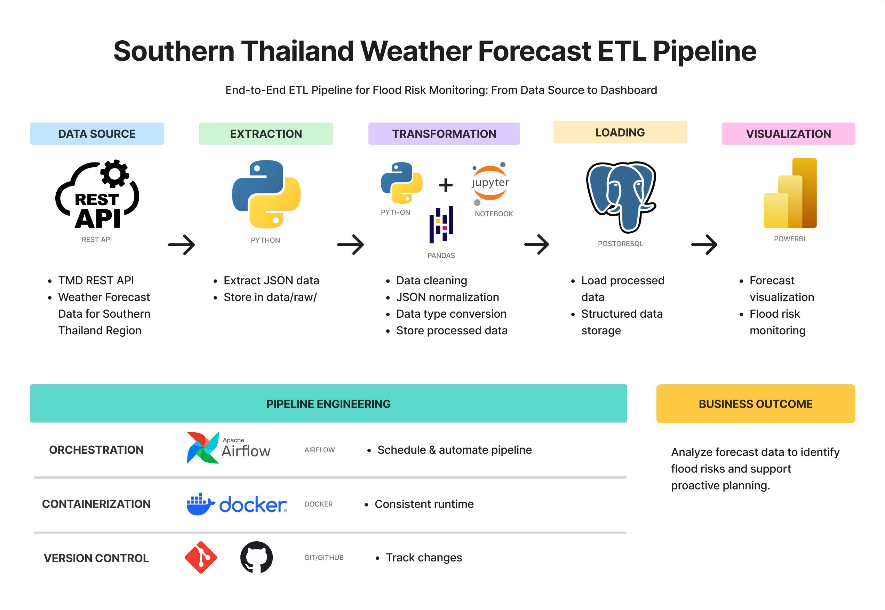

# Southern Thailand Weather Forecast ETL Pipeline

Southern Thailand Weather Forecast ETL Pipeline is an individual project for learning data engineering and building an ETL pipeline to collect, transform, and analyze weather data from Southern Thailand.

## Project Overview

This project builds an ETL pipeline that:
- Extracts weather forecast data from the TMD API
- Stores the original API response as raw JSON
- Transforms and cleans the data using Python and Pandas
- Stores processed data for further analysis
- Loads structured data into PostgreSQL
- Provides data for weather and potential flood-risk analysis

## Tech Stack

- Python
- Pandas
- REST API
- PostgreSQL
- Docker
- Apache Airflow
- Power BI

## Prerequisites

- Python 3.12+
- PostgreSQL 16+
- Git
> I personally developed/tested on Python 3.14.6 and PostgreSQL 18.4

## Setup

### 1. Clone the repository

```
    git clone https://github.com/MeldyRose/Southern-Thailand-Weather-Forecast-ETL-Pipeline.git
    cd Southern-Thailand-Weather-Forecast-ETL-Pipeline
```

### 2. Create a virtual environment

```
    python -m venv .venv
```

Activate it:

**Windows**
```
    .venv\Scripts\activate
```

### 3. Install dependencies

```
    pip install -r requirements.txt
```    

### 4. Configure environment variables

Create a `.env` file:
```
    API_KEY=your_api_key
    DATABASE_URL=your_database_url
```  
> Never commit your `.env` file or API key to Git.

### 5. Run the pipeline

Currently, main.py is used as orchestration, with Apache Airflow planned for future automation.
```
    python -m src.main
```  

## ETL Pipeline



## Project Structure

Southern-Thailand-Weather-Forecast-ETL-Pipeline/
│
├── data/
│   ├── raw/
│   └── processed/
│
├── sql/
│   ├── 01_weather_risk_views.sql
│   ├── 02_rainfall_accumulation.sql
│   ├── 03_rainfall_streaks.sql
│   └── 04_rainfall_saved_streaks.sql
│
├── src/
│   ├── config.py
│   ├── extraction.py
│   ├── transformation.py
│   ├── main.py
│   ├── load/
│   └──`__init__.py`
├── .env.example
├── ETL_Architecture.png
├── requirements.txt
└── README.md


## Data Source

- Thai Meteorological Department(TMD) API

## Data Dictionary

The processed weather data will be used to explore:

- tc = temperature in Celsius
- tc_max = maximum temperature in Celsius
- tc_min = minimum temperature in Celsius
- rain = rainfall in millimeters
- rh = relative humidity in percentage
- slp = sea level pressure in hPa
- ws10m = wind speed at 10 meters in meters per second
- wd10m = wind direction at 10 meters in degrees
- cloudlow = low cloud cover in percentage
- cloudmed = medium cloud cover in percentage
- cloudhigh = high cloud cover in percentage
- cond = weather condition
    - 1 = ท้องฟ้าแจ่มใส (Clear)
    - 2 = มีเมฆบางส่วน (Partly cloudy)
    - 3 = เมฆเป็นส่วนมาก (Cloudy)
    - 4 = มีเมฆมาก (Overcast)
    - 5 = ฝนตกเล็กน้อย (Light rain)
    - 6 = ฝนปานกลาง (Moderate rain)
    - 7 = ฝนตกหนัก (Heavy rain)
    - 8 = ฝนฟ้าคะนอง (Thunderstorm)
    - 9 = อากาศหนาวจัด (Very cold)
    - 10 = อากาศหนาว (Cold)
    - 11 = อากาศเย็น (Cool)
    - 12 = อากาศร้อนจัด (Very hot)
     
## Analysis

The data produced by the ETL pipeline is structured and stored in PostgreSQL so that it can be used for different types of analysis and downstream applications.

For this project, the processed weather data is used to analyze **forecast rainfall and potential flood-risk indicators in Southern Thailand**. SQL views are created to transform the structured weather data into analytical datasets for the current use case.

Although the analysis focuses on rainfall and flood-risk indicators, the ETL pipeline is designed to produce reusable weather data that can support other analytical tasks in the future.

### Current Analysis

The current analysis focuses on the following areas:

#### 1. Rainfall Risk Classification

Rainfall values are classified into different intensity or risk levels to identify locations with higher forecast rainfall.

This allows rainfall conditions to be compared across different locations and provinces.

#### 2. Rainfall Accumulation

Rainfall accumulation is calculated across multiple forecast periods to identify areas that may experience sustained rainfall.

The analysis includes:

- 1-day rainfall accumulation
- 3-day rainfall accumulation
- 7-day rainfall accumulation

This provides more context than analyzing rainfall from a single forecast day.

#### 3. Consecutive Rainfall Streaks

The pipeline identifies consecutive rainy days for each forecast location.

A rainy day is currently defined as:

```
rain > 10 mm
```

## Future Improvements

- Add automated orchestration with Apache Airflow
- Containerize the pipeline with Docker
- Add data quality tests

